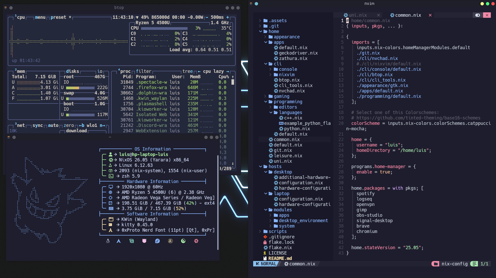

<div align="center">
  

  <h3 align="center">NixOS config</h3>

  <p align="center">
   This repository contains my personal NixOS configuration, which defines my entire system in a fully declarative and reproducible way. 
  </p> 
</div>

## About NixOS

NixOS is a Linux distribution built on the Nix package manager, known for its declarative configuration model and atomic, reproducible system builds. For further Information visit the [NixOS Homepage](https://www.nixos.org)



## Installation

Move your `hardware-configuration.nix` file in `/hosts/laptop/` and deploy the flake with this command: 

```
sudo nixos-rebuild switch --flake .#laptop
```

<!-- LICENSE -->
## License

Distributed under the MIT License. See `LICENSE` for more information.
